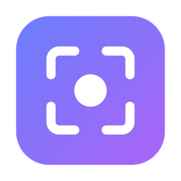
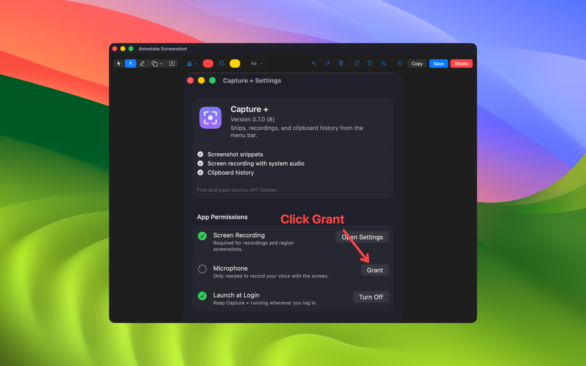
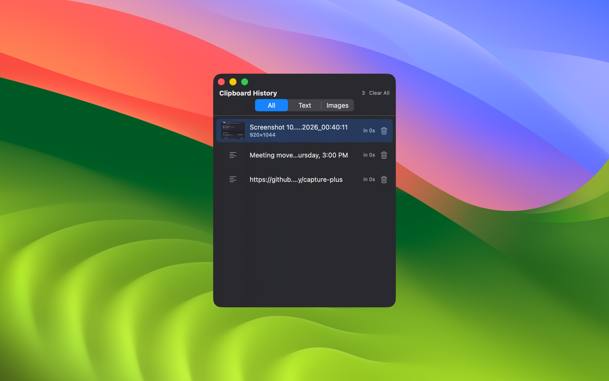
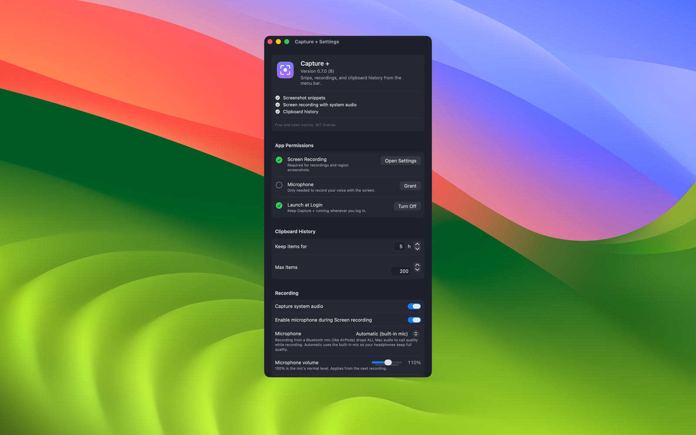

<div align="center">



# Capture +

**Record your screen, snip screenshots, mark them up, and keep a short clipboard history. All from the Mac menu bar.**

Screenshots go straight to your clipboard instead of your desktop. Recordings capture system audio and, if you want, your mic. Everything stays on your Mac.

[](../../releases/latest)

macOS 15 or later · Apple silicon · Free and open source

<br />



</div>

## See it in action

| Clipboard history | Settings |
|---|---|
|  |  |

## What it does

- **Screen recording.** Record a display, a single window, or every display at once, with system audio and an optional microphone. A short countdown, then a quick trim step before it saves. Files are named by date and time in the folder you choose.
- **Screenshots that land on the clipboard.** Drag a region and it is on your clipboard instantly. Nothing is written to disk unless you choose Save. A corner thumbnail takes you straight into the editor.
- **Annotation editor.** Pen, highlighter, arrows and shapes, text with font and style controls, color, fill and thickness, undo and redo, crop. Then Copy or Save.
- **Clipboard history.** Everything you copy, kept for five hours by default (adjustable from one hour to a day), with thumbnails, All / Text / Images tabs, and one-click re-copy.
- **Lives in the menu bar.** No Dock icon, optional launch at login, and shortcuts that stay out of the way of the system screenshot keys.
- **Private by design.** No analytics, no account. The only network use is a daily check for updates; **Check for Updates…** in the menu runs it on demand.

## Keyboard shortcuts

All three can be changed in **Settings → Shortcuts**. The defaults avoid the macOS screenshot bindings (⌘⇧3, ⌘⇧4, ⌘⇧5):

| Action | Default |
|---|---|
| Start or stop recording | <kbd>⌘</kbd> <kbd>⇧</kbd> <kbd>1</kbd> |
| Screenshot a region to the clipboard | <kbd>⌘</kbd> <kbd>⇧</kbd> <kbd>2</kbd> |
| Show clipboard history | <kbd>⌘</kbd> <kbd>⇧</kbd> <kbd>V</kbd> |

## Install

1. Download **Capture-Plus.dmg** from the [latest release](../../releases/latest).
2. Open it and drag **Capture +** into **Applications**.
3. Open Capture + from Applications. It is signed and notarized by Apple, so there is no warning to click through.
4. The first time you take a screenshot or recording, macOS asks for **Screen Recording** permission. Allow it; that is what lets Capture + see your screen. **Microphone** is only requested if you turn on mic recording.

Updates arrive inside the app: it checks once a day and offers new versions, or use **Check for Updates…** in the menu.

## Build from source

Requires macOS 15 or later and Xcode 16 or later.

```bash
# 1. Install the project generator
brew install xcodegen

# 2. Signing: the project expects a "Developer ID Application" certificate in
#    your keychain (Xcode → Settings → Accounts → Manage Certificates). Without
#    an Apple Developer account, change CODE_SIGN_IDENTITY in project.yml to "-"
#    (ad-hoc) for a local build.

# 3. Build, sign, and install to /Applications
./scripts/build.sh

# 4. (Optional) Package a notarized disk image → dist/Capture-Plus.dmg
#    (needs the "capture-plus-notary" notarytool keychain profile, see the script)
./scripts/make-dmg.sh

# 5. (Maintainer) Cut a release: version bump, build, notarize, GitHub release, update feed
./scripts/release.sh 0.7.1 "Title" "Release notes"
```

`.xcodeproj` is generated by XcodeGen from [`project.yml`](project.yml) and is not checked in. Run `xcodegen generate` (or `build.sh`) after cloning.

## How it's built

| Area | Tech |
|---|---|
| UI | AppKit + SwiftUI, menu-bar (`LSUIElement`) app |
| Recording | [ScreenCaptureKit](https://developer.apple.com/documentation/screencapturekit) `SCStream` into our own `AVAssetWriter`, HEVC, fragmented so a crash never loses the whole file |
| Trimming | AVFoundation / `AVPlayerView` |
| Clipboard | `NSPasteboard` change-count polling; concealed and transient types are skipped |
| Global shortcuts | [KeyboardShortcuts](https://github.com/sindresorhus/KeyboardShortcuts) by Sindre Sorhus |
| Updates | [Sparkle](https://sparkle-project.org) |

## Signing and distribution

Releases are signed with an Apple Developer ID certificate and notarized, so macOS opens them with a double-click and keeps the app's permissions across updates. Updates are delivered in-app with Sparkle from the `appcast.xml` in this repo, pointing at the DMG attached to each GitHub release.

## License

[MIT](LICENSE) © 2026 Johnny Ly. Third-party notices in [THIRD-PARTY-LICENSES.md](THIRD-PARTY-LICENSES.md).

*A personal utility, shared in case it's useful. Not affiliated with any similarly named app.*
